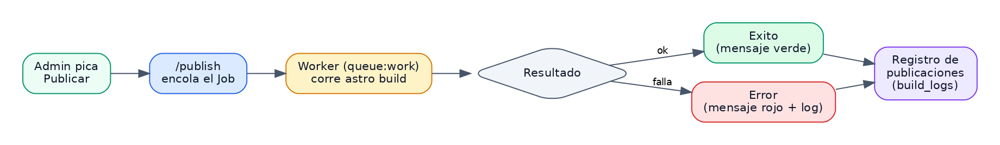
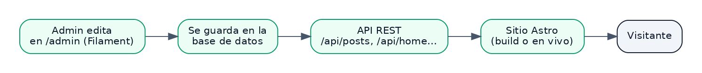
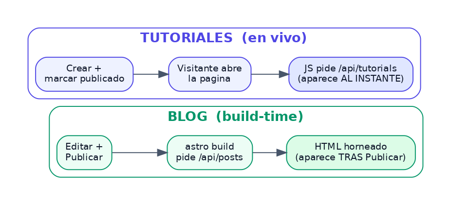
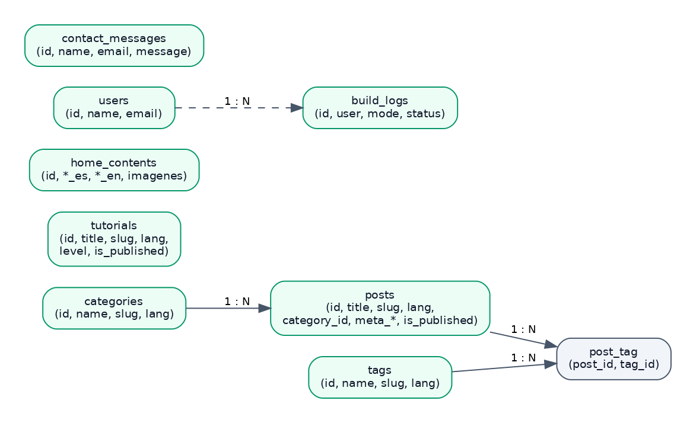

# ZOOBLOG — Documentación técnica completa

Blog educativo bilingüe (español / inglés) sobre animales. Este documento explica
**a detalle** cómo está construido el proyecto: dónde vive cada parte, cómo funciona
el blog, los tutoriales y la portada, y cómo se conecta todo.

> **Repositorio (monorepo):** `github.com/GokhiPelgo/zooblog` — contiene las dos
> aplicaciones en subcarpetas: `blog-frontend/` (Astro) y `blog-backend/` (Laravel).

---

## 1. Visión general

ZooBlog está formado por **dos aplicaciones independientes** que se comunican por
HTTP, más un par de **servicios externos** para tareas específicas.

- **Frontend (Astro):** el sitio que ve el visitante. Es **estático**.
- **Backend (Laravel + Filament):** la "trastienda" — panel de administración,
  API y base de datos. **Todo el contenido se administra aquí** (blog, tutoriales,
  portada, mensajes).
- **Servicios externos (en producción):** Cloudflare R2 (imágenes) y Resend (correos).

El frontend y el backend **no son "dependencias" uno del otro**: son dos apps
separadas que se hablan por HTTP.

---

## 2. Arquitectura — dónde vive cada cosa

| Pieza | Tecnología | Dónde vive (producción) |
|-------|-----------|-------------------------|
| **Frontend** | Astro (estático) | **Vercel** |
| **Backend** | Laravel 13 + Filament 5 | **Render** (Docker) |
| **Base de datos** | PostgreSQL (prod) / SQLite (local) | Render / tu máquina |
| **Imágenes** | Cloudflare R2 (S3) en prod / disco local en local | Cloudflare / tu máquina |
| **Correos** | Resend (prod) / log (local) | Resend.com |

```
┌─────────────┐                     ┌───────────────────┐
│  FRONTEND   │  ── GET /api/* ──▶  │     BACKEND       │
│  Astro      │                     │  Laravel+Filament │──▶ Base de datos
│  (Vercel)   │  ◀─ JSON ─────────  │  (Render)         │──▶ Resend (correo)
└─────────────┘                     └───────────────────┘
   estático                          panel /admin + API
```

Todo el contenido (blog, tutoriales, portada) vive en la **base de datos** del
backend y se administra desde el **panel** de Filament.

---

## 3. El frontend (Astro)

**Repositorio:** `github.com/GokhiPelgo/zooblog` (carpeta `blog-frontend/`)
**Hosting:** Vercel (gratis). Despliega con cada `git push` a `main`
(en Vercel, el *Root Directory* apunta a `blog-frontend`).

### Tecnologías
- **Astro 6** en modo `output: 'static'` → genera HTML plano servido desde el CDN.
- **Tailwind CSS 4** (vía `@tailwindcss/postcss`).
- **GSAP** y **Lenis** para animaciones y scroll suave.
- **i18n nativo** de Astro: idiomas `es` (por defecto) y `en`, con rutas `/[lang]/...`.

### Estructura de páginas (`src/pages/`)
- `[lang]/index.astro` → **Home / Portada** (editable desde el panel — ver §6b).
- `[lang]/blog/index.astro` → listado del blog (lee de la API del backend).
- `[lang]/blog/[slug].astro` → artículo del blog.
- `[lang]/categoria/[slug].astro` → artículos por **categoría**.
- `[lang]/etiqueta/[slug].astro` → artículos por **etiqueta**.
- `[lang]/tutoriales/index.astro` y `ver.astro` → tutoriales (lee del backend, en vivo).
- `[lang]/[slug].astro` → páginas estáticas (Sobre nosotros, Servicios, Contacto).
- `sitemap.xml.ts`, `robots.txt.ts` → SEO (se generan en el build).

El cliente que consume la API del blog vive en **`src/lib/blog.ts`**.

### Dos momentos en que se arma el contenido
- **En el build (`astro build`):** el **blog** y la **portada (Home)** piden su
  contenido al backend (`/api/posts`, `/api/home/{lang}`) y lo "hornean" en el HTML
  (bueno para SEO). Si el backend no responde, se usan valores por defecto para que
  el build nunca se rompa.
- **En vivo (en el navegador):** los **tutoriales** y el **formulario de contacto**
  se piden al backend **cuando el visitante abre la página** (no en el build).

### Variables de entorno (frontend)
- `PUBLIC_API_URL` = URL del backend.
- `PUBLIC_SITE_URL` = URL del sitio (para canonical, sitemap, OG y hreflang).

---

## 4. El backend (Laravel + Filament)

**Repositorio:** `github.com/GokhiPelgo/zooblog` (carpeta `blog-backend/`)
**Hosting:** Render (gratis), con **Docker**. Redespliega con cada `git push`
(*Root Directory* = `blog-backend`).

### Qué hace
1. **Panel de administración** (Filament) en `/admin`: administra el **blog**
   (artículos, categorías, etiquetas), los **tutoriales**, la **portada (Home)**,
   ve los **mensajes** de contacto y el **registro de publicaciones**.
2. **API REST** que el frontend consume.
3. **Base de datos** donde vive todo el contenido.

### Secciones del panel (`/admin`)
- **Inicio (portada)** — editar el Home.
- **Blog** (grupo): **Artículos**, **Categorías**, **Etiquetas**.
- **Tutorials** — los tutoriales.
- **Registro de publicaciones** — bitácora de cada Publicar (solo lectura).
- Botón **🚀 Publicar** siempre visible en la barra superior.

### Rutas de la API
| Método | Ruta | Para qué |
|--------|------|----------|
| `GET`  | `/api/posts?lang=es` | Lista los artículos publicados (filtros: `category`, `tag`) |
| `GET`  | `/api/posts/{slug}?lang=es` | Un artículo por su slug |
| `GET`  | `/api/categories?lang=es` | Lista las categorías |
| `GET`  | `/api/tutorials?lang=es` | Lista los tutoriales publicados |
| `GET`  | `/api/tutorials/{slug}?lang=es` | Un tutorial por su slug |
| `GET`  | `/api/home/{lang}` | Contenido de la portada (Home) por idioma |
| `POST` | `/api/contact` | Recibe el formulario de contacto |
| `GET`  | `/api/contact-messages` | Lista los mensajes (requiere token admin) |
| `POST` | `/publish` | Botón "Publicar" (build local o deploy hook — ver §8) |
| `GET`  | `/publish/status` | Estado del build (lo consulta el botón) |

### Variables de entorno clave (en Render / producción)
`APP_KEY`, `APP_ENV=production`, `DB_*` (Postgres), `FRONTEND_URL` (CORS),
`MAIL_MAILER=resend` + `RESEND_API_KEY`, `DEPLOY_HOOK_URL`, `ADMIN_PASSWORD`,
`UPLOADS_DISK=s3` + `AWS_*` (R2).

---

## 5. Cómo funciona el BLOG

El blog se administra **100% desde Filament** (Laravel) y vive en la base de datos.
Antes usaba Prismic; **ya no** — todo está integrado en el panel.

### Estructura de datos
- **Artículos** (`posts`): el contenido principal.
- **Categorías** (`categories`): cada artículo pertenece a **una** categoría.
- **Etiquetas** (`tags`): un artículo puede tener **varias** (relación `post_tag`).

### Campos de un artículo
| Campo | Para qué |
|-------|----------|
| `title` | Título |
| `slug` | URL del artículo (solo minúsculas, números y guiones — validado) |
| `translation_key` | Enlaza las versiones es/en (mismo valor en ambas) |
| `lang` | Idioma (`es`/`en`) |
| `category_id` | Categoría a la que pertenece |
| `tags` | Etiquetas (relación muchos-a-muchos) |
| `excerpt` | Resumen corto para la tarjeta |
| `content` | Cuerpo del artículo (editor enriquecido → HTML) |
| `cover_image` | Imagen de portada |
| `image_alt` | Texto alternativo de la imagen (SEO/accesibilidad) |
| `meta_title` / `meta_description` | **SEO on-site** (title y description) |
| `is_published` | **Estatus**: publicado o borrador |
| `published_at` | Fecha de publicación |

### Flujo paso a paso
1. Creas/editas el artículo en `/admin` → **Blog → Artículos** (con categoría,
   etiquetas, SEO, imagen) y lo marcas **Publicado**.
2. Se guarda en la base de datos.
3. Al **Publicar**, Astro reconstruye el sitio pidiendo los artículos a
   `GET /api/posts` y los deja "horneados" en el HTML (bueno para SEO).

**Importante:** el blog es **build-time** — un artículo nuevo aparece en el sitio
**tras Publicar** (a diferencia de los tutoriales, que salen en vivo).

### Bilingüe y estatus
- Cada idioma tiene su **propio slug** (SEO); se enlazan con `translation_key`.
- **Borrador vs publicado:** solo los artículos con `is_published` verdadero salen
  en el sitio y en la API.

---

## 6. Cómo funcionan los TUTORIALES

Los tutoriales se administran desde **Filament** y viven en la base de datos.

### Campos de un tutorial
| Campo | Para qué |
|-------|----------|
| `title` | Título |
| `slug` | URL (solo minúsculas, números y guiones — validado) |
| `translation_key` | Enlaza las versiones es/en |
| `lang` | Idioma (`es`/`en`) |
| `excerpt` | Resumen corto |
| `content` | Cuerpo (editor enriquecido → HTML) |
| `cover_image` | Imagen de portada |
| `image_alt` | Texto alternativo (SEO/accesibilidad) |
| `level` | Nivel → sirve de "categoría" (filtro) |
| `is_published` | Publicado o borrador |

### Flujo
1. Creas/editas el tutorial en `/admin` y marcas `is_published`.
2. El frontend, al abrir `/es/tutoriales`, **pide los tutoriales al backend en vivo**
   (`GET /api/tutorials?lang=es`).
3. Como es **en vivo (client-side)**, un tutorial nuevo aparece **sin reconstruir**.

### Diferencia BLOG vs TUTORIALES
| | Blog | Tutoriales |
|---|---|---|
| Cuándo aparece | Tras Publicar (build) | En vivo (al instante) |
| Clasificación | Categorías + etiquetas | Nivel |
| Color | Verde esmeralda | Índigo |

---

## 6b. Cómo funciona la PORTADA (Home)

La portada (el "hero" de la página principal) es **editable desde el panel**. Su
contenido vive en la tabla `home_contents`.

### Qué se puede editar
Textos (badge, título, subtítulo), los **dos botones** (texto + enlace), las **4
imágenes** del collage y el **texto alternativo (alt)** de cada imagen — todo en
**español e inglés**.

### Cómo está modelado
- Un **único registro** con columnas por idioma (`title_es`, `title_en`, …). Las
  imágenes son **compartidas** entre idiomas; el *alt* es **por idioma** (SEO).
- En el panel se edita en **una sola página con pestañas Español / English**
  (menú *"Inicio (portada)"*).
- Si una imagen se deja vacía, el sitio usa la **imagen por defecto**.

### Cómo llega al sitio
El backend expone `GET /api/home/{lang}`. El Home de Astro lo pide **en el build**,
así que los cambios se ven **tras Publicar**. Si el backend no responde, usa textos
por defecto (nunca se rompe).

---

## 7. Formulario de contacto + correos

**Flujo:**
1. El visitante llena el formulario en `/es/contacto`.
2. El **navegador valida** (comodidad, no seguridad).
3. Hace `POST /api/contact` al backend (CORS ya configurado).
4. Laravel **revalida y limpia** (`ContactRequest`), **guarda** el mensaje y **manda
   un correo** al administrador. En local `MAIL_MAILER=log` (no se envía, se registra);
   en producción, con Resend.

**Ver los mensajes:** en `/admin` o con `GET /api/contact-messages` (header `X-Admin-Token`).

---

## 8. El botón "Publicar"

En la barra superior del panel hay un botón **"🚀 Publicar"** siempre visible. Al
pulsarlo aparece una **alerta de confirmación** antes de continuar. Tiene **dos
modos**, según `PUBLISH_MODE`:

**Modo `local` (tu máquina) — build en SEGUNDO PLANO:**
1. La ruta `/publish` **encola** un trabajo (`PublishSiteJob`) y **responde al
   instante** (no congela la página).
2. Un **worker** de la cola (`php artisan queue:work`) ejecuta `npm run build`
   (**`astro build`**) por detrás y compila el sitio a `dist/`.
3. El botón **consulta el estado** cada ~2.5s: ⏳ *"Compilando…"* → 🟢 *"Publicación
   exitosa"* o 🔴 *"No se pudo publicar…"* con el detalle (que también queda en
   `storage/logs/laravel.log`).

> El estado se guarda en **Cache** (`publish.status`) y se consulta con
> `GET /publish/status`. Así la página nunca se congela esperando el build.

**Modo `hook` (producción / Vercel):**
1. La ruta `/publish` hace un POST al **deploy hook de Vercel** (`DEPLOY_HOOK_URL`).
2. Vercel reconstruye y despliega el sitio.

**Qué se publica:** el **blog** y la **portada (Home)** (build-time). Los tutoriales
ya aparecen en vivo y no lo necesitan.

**Notas del modo local:**
- Requiere el **worker** corriendo: `php artisan queue:work` (`QUEUE_CONNECTION=database`).
- Como el build corre en el worker (proceso aparte), no hay *deadlock*; conviene
  `php artisan serve --no-reload` (`PHP_CLI_SERVER_WORKERS=4`).
- Laravel encuentra `npm` con `FRONTEND_BUILD_COMMAND` (útil con nvm).
- La ruta `/publish` está protegida con `auth`.

---

## 8b. Registro de publicaciones (bitácora)

Cada vez que se pica **Publicar**, se guarda un registro en la tabla `build_logs`:
**quién** publicó, **cuándo** y el **resultado** (en proceso / éxito / error). Se ve
en el panel, en la sección **"Registro de publicaciones"** (solo lectura). Es una
bitácora de negocio, distinta del archivo técnico `storage/logs/laravel.log`.

---

## 9. Flujos clave (resumen)

**Publicar un artículo de blog:** `/admin` → Blog → Artículos → nuevo (categoría,
etiquetas, SEO, imagen) → marcar Publicado → botón **Publicar** → aparece en el sitio.

**Crear un tutorial:** `/admin` → Tutorials → nuevo → publicar → aparece en vivo.

**Editar la portada (Home):** `/admin` → *Inicio (portada)* → pestañas ES/EN →
Guardar → **Publicar**.

**Enviar contacto:** formulario → `POST /api/contact` → guarda en BD + correo.

---

## 10. Seguridad

- **Acceso al panel:** el modelo `User` implementa `FilamentUser`. Contraseña del
  admin en variable de entorno (`ADMIN_PASSWORD`), no en el código.
- **Cambio de contraseña:** página de **Perfil** (menú de usuario → Perfil).
- **Redirección de invitados:** ruta con nombre `login` que envía al login del panel.
- **CORS:** el backend solo acepta peticiones del dominio del frontend (`FRONTEND_URL`).
- **Proxy:** `trustProxies` para detectar HTTPS detrás del proxy de Render.
- **Validación:** doble (cliente + servidor) en el formulario.
- **Rate limiting:** 5 mensajes/hora por IP en contacto; límite de lectura en la API.
- **Token de admin:** el listado de mensajes se compara con `hash_equals`.

---

## 10b. Pruebas automatizadas (tests)

El backend incluye una **suite de pruebas** (Feature tests) que se corre con:

```bash
php artisan test
```

Usan una base de datos **SQLite en memoria** y correo **falso** (no tocan datos
reales). Cubren:

- **Blog:** que `/api/posts` solo devuelva publicados, que filtre por idioma y
  categoría, que muestre categoría/etiquetas y responda 200/404 por slug.
- **Tutoriales:** publicados, filtro por idioma y 200/404 por slug.
- **Portada (Home):** contenido correcto por idioma y 404 si no hay datos.
- **Contacto:** guardar + notificar, rechazo (422) y token de admin.
- **Publicar:** que un invitado no pueda publicar, que se encole el build sin
  bloquear y que se registre la bitácora.

---

## 11. Cómo correr en local

Necesitas **3 terminales**: backend, worker de la cola y frontend.

**Backend (preparación, una vez):**
```bash
cd blog-backend
composer install
cp .env.example .env
php artisan key:generate
touch database/database.sqlite   # SQLite en local
php artisan migrate
php artisan db:seed              # datos de ejemplo + admin + portada + blog
php artisan storage:link         # servir las imágenes subidas
```

**Terminal 1 — servidor:**
```bash
php artisan serve --no-reload    # http://localhost:8000
```

**Terminal 2 — worker (procesa el build al Publicar):**
```bash
php artisan queue:work
```

**Terminal 3 — frontend:**
```bash
cd blog-frontend
npm install
cp .env.example .env             # PUBLIC_API_URL=http://localhost:8000, etc.
npm run dev                      # http://localhost:4321
```

> Para que el botón **Publicar** compile en local: `PUBLISH_MODE=local`,
> `PHP_CLI_SERVER_WORKERS=4` en el `.env`, servidor con `--no-reload` y `queue:work`
> activo. Panel: **http://localhost:8000/admin** (`chelo@zooblog.com` / `password123`).

---

## 12. Servicios y costos

En local no cuesta nada (SQLite + disco local + correos en `log`). En producción,
todo el stack está en **planes gratuitos**:
- **Vercel** (frontend): gratis.
- **Render** (backend + Postgres): gratis (el servidor se "duerme" tras inactividad).
- **Cloudflare R2** (imágenes): gratis hasta 10 GB.
- **Resend** (correos): gratis (3,000/mes; requiere dominio verificado para enviar a
  cualquier destinatario).

El único costo opcional a futuro sería un **dominio propio** (~$10/año).

---

## 13. Stack tecnológico (niveles)

Lo que se necesita para levantar el proyecto, en tres niveles:

| | Básico | Normal | Óptimo |
|---|---|---|---|
| Base de datos | SQLite | SQLite | PostgreSQL |
| Cola / worker | — | `queue:work` | Redis + Horizon |
| Correos | log | log | Resend + dominio |
| Imágenes | disco local | disco local | R2 / S3 |
| Botón Publicar | manual (`npm run build`) | automático | automático |
| Pruebas / CI | — | tests locales | CI/CD |
| Monitoreo | — | — | Sentry + respaldos |
| Para qué sirve | demostrar que corre | desarrollar cómodo | producción real |

- **Básico:** PHP 8.3 + Composer, Node 22 + npm y SQLite. Solo `php artisan serve`
  y `npm run dev` (sin worker; el build se hace a mano con `npm run build`).
- **Normal (el actual):** lo básico + worker de la cola (`queue:work`) +
  `serve --no-reload` + pruebas. Atajo: `composer dev`.
- **Óptimo:** PostgreSQL, Redis + Supervisor/Horizon, R2/S3, Resend con dominio,
  HTTPS, CI/CD, monitoreo (Sentry) y respaldos automáticos.

---

## 14. Diagramas

**Flujo del botón "Publicar"** (build en segundo plano):



**Flujo del contenido** (del panel al sitio que ve el visitante):



**Blog (build-time) vs Tutoriales (en vivo):**



**Base de datos** (tablas principales y sus relaciones):



---

*ZOOBLOG — Documentación técnica © 2026*
